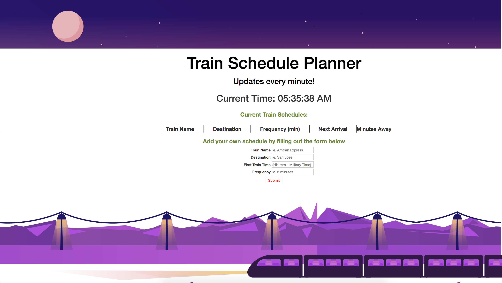

# Title: firebased-train-scheduler
## Site Picture:


## Technologies Used:
- HTML: Used to create elements 
- Google Firebase: 
- jQuery: Allowed me to dynamically create elements that could be appended/prepended to the html files
- JavaScript: Used in the HTLM files and JS files
- Bootstrap: Navbar, button(s) and form were mainly used with the help of the resources of Bootstrap's preset codes
- CSS: Used to make to make the styling of the background image and colors & sizes
- Git: Used to document the changes of the source code
- GitHub: Used to create the repository for the html and css in which that can be pushed to GitHub domain

## Summary:
This assignment we learned to used all the javascript and jQuery learned throughout the class the last 1.5 weeks and where we were able to fully implement out the DOM methods in creating dynamic elements...ranging from .appends, .on clicks, creating elements (ie. divs, classes, ids, variables, rows, img srcs and many more. 

## Code Snippet:
```html
<body>
    <!-- used Bootstrap Jumbotron to create my header title page -->
    <div class="jumbotron">
        <div class="col-lg-12 col-sm-12 col-xs-12" id="titlePage">
            <h1 class="text-center">Train Schedule Planner</h1>
            <h2 class="text-center">Updates every minute!</h2>
        </div>
    </div>


    <!-- created a 'mainContain' class div to hold everything easily -->
    <div class="mainContainer">

        <!-- where the current time will be displayed -->
        <div class="row">
            <div class="col-lg-12">
                <h1 class="text-center currentTime"> Current Time: <span id="currentTime" class="clockDisplay"></span>
                </h1>
            </div>
        </div>


        <div class="row">
            <div class="col-lg-12">
                <div class="panel defaultPanel">

                    <!-- List of Available Train Schedules Area -->
                    <div class="headerPanel">
                        <h3 class="titlePanel">List of Available Train Schedules</h3>
                    </div>

                    <!-- Body area of the page that hold the train schedules (preset and dynamic)-->
                    <div class="bodyPanel">
                        <!-- where the set variables needed of the train scheduling table is placed -->
                        <table class="trainTable">
                            <tr id="dynamicTable>">
                                <th>Train Name</th>
                                <th>Destination</th>
                                <th>Frequency (min)</th>
                                <th>Next Arrival</th>
                                <th>Minutes Away</th>
                            </tr>
                        </table>

                    </div>
                </div>
            </div>
        </div>

<!----------------------------- User form portion of the page ---------------------------------->
        <div class="row">
            <div class="col-lg-12">
                <div class="panel defaultPanel">
                    <div class="headerPanel">
                        <h3 class="titlePanel">Add your own schedule by filling out the form below</h3>
                    </div>

                    <div class="bodyPanel">
                        <!-- Area where the user inputs their own train schedules  -->
                        <form role="trainScheduleForm">
                            <div class="dynamicGroupForm">
                                <label for="text">Train Name</label>
                                <input type="text" class="userFormInput" id="trainName" placeholder="Amtrak Express">
                            </div>
                            <div class="dynamicGroupForm">
                                <label for="text">Destination</label>
                                <input type="text" class="userFormInput" id="trainDestination" placeholder="San Francisco">
                            </div>
                            <div class="dynamicGroupForm">
                                <label for="text">First Train Time (HH:mm - Military Time)</label>
                                <input type="text" class="userFormInput" id="trainArrival" placeholder="14:00">
                            </div>
                            <div class="dynamicGroupForm">
                                <label for="text">Frequency (min)</label>
                                <input type="number" class="userFormInput" id="trainFrequency" placeholder="15">
                            </div>
                            <!-- Submit Button is created, by Bootstrap, and placed here -->
                            <button type="submit" class="btn btn-default" id="submitBtn">Submit</button>
                        </form>
                    </div>
                </div>
            </div>
        </div>

        <!-- Link ref to jQuery -->
        <script src="https://code.jquery.com/jquery.js"></script>
        <!-- Link ref to Firebase -->
        <script src="https://www.gstatic.com/firebasejs/3.4.0/firebase.js"></script>
        <!-- Link ref to moment.js -->
        <script src="https://cdn.jsdelivr.net/momentjs/2.12.0/moment.min.js"></script>
        <!-- Link ref to app.js file -->
        <script src="assets/javascript/app.js"></script>


</body>
  
```


## Author Links:
[GitHub](https://github.com/duongsters)